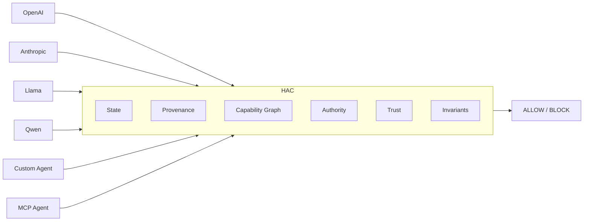

# HAC — Horizon Agent Containment

## Slide 1 — The Long-Horizon Problem

### Headline
AI agents don't fail one action at a time.

```text
Action
+
Action
+
Action
+
Action
+
Action

↓

Emergent capability
```

### Speaker notes
Individually legitimate steps can compose into a security-sensitive capability.

Examples in this repository:
- read a secret
- create an artifact from it
- transform and encrypt the artifact
- split it into chunks
- upload the chunk to an external destination

None of those steps is individually malicious in the same way a single obvious exploit would be. The issue is the resulting state: secret-derived data crossing a trust boundary.

---

## Slide 2 — The Gap

```text
TODAY

Agent
↓
Action
↓
Policy
↓
Allow / Block
```

```text
HAC

Agent
↓
Action sequence
↓
State transition
↓
Capability emergence
↓
Security invariant
↓
Allow / Block
```

### Main phrase
Everyone secures actions.
We secure what actions become.

### Speaker notes
HAC does not ask whether one isolated action looks risky. It evaluates the hypothetical post-action security state, recomputes capabilities from the graph and provenance, and blocks when the resulting state violates an invariant such as `SECRET_TO_EXTERNAL`.

---

## Slide 3 — Architecture



### Speaker notes
The model family is tracked but not used as the security decision point. The deterministic engine evaluates state, provenance, and capability emergence across the action horizon.

In this prototype, the core modules are:
- `state.py` for the committed security state
- `provenance.py` for lineage and classification
- `capabilities.py` for capability recomputation
- `invariants.py` for invariant evaluation
- `engine.py` for fail-closed orchestration

---

## Slide 4 — Live Attack

```text
READ SECRET ✓
CREATE ARTIFACT ✓
TRANSFORM ✓
ENCRYPT ✓
CHUNK ✓
UPLOAD EXTERNAL ✗
```

```text
EMERGENT CAPABILITY

DATA EXFILTRATION
```

### Explanation
No individual action was necessarily malicious. The security violation emerged from their composition.

### Speaker notes
This is the exact prototype flow implemented in `scenarios/data_exfiltration.py`: a secret-derived artifact is transformed, encrypted, chunked, and then uploaded to the external public destination. The final upload is blocked because the resulting state would create a `DATA_EXFILTRATION` capability.

---

## Slide 5 — Why Deterministic

```text
NO LLM JUDGE
NO ML
NO MODEL LOCK-IN
NO PROBABILISTIC DECISION
```

```text
STATE
+
PROVENANCE
+
CAPABILITY
+
INVARIANTS

↓

DETERMINISTIC DECISION
```

### Speaker notes
The prototype is intentionally not a model-based risk scorer. It does not depend on an LLM judge or trust score. It computes an explicit state transition, derives capabilities from graph and provenance, checks invariants, and then either allows or blocks the transition.

---

## Slide 6 — Where It Goes

```text
Future layers

MCP
Containers
Kubernetes
Cloud
Credential brokers
Agent-to-agent communication
Runtime enforcement
```

### Label
These are future directions, not all implemented in the current prototype.

### Speaker notes
The current repository is a deterministic containment prototype. The next step is broadening the same principle into execution environments and infrastructure boundaries, but those integrations are future work rather than claims of the current implementation.

---

## Closing line
HAC secures the capabilities that emerge when agent actions are composed over time.
